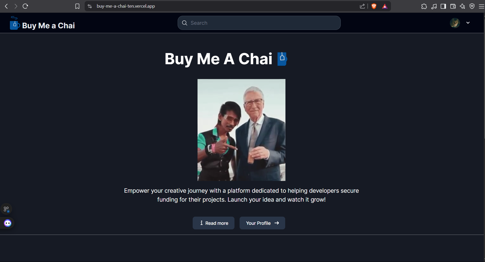
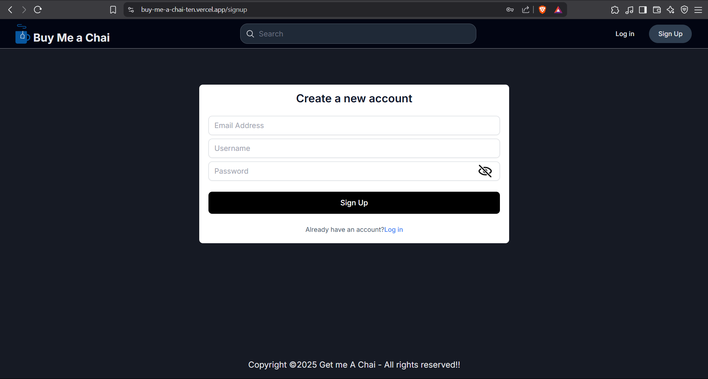
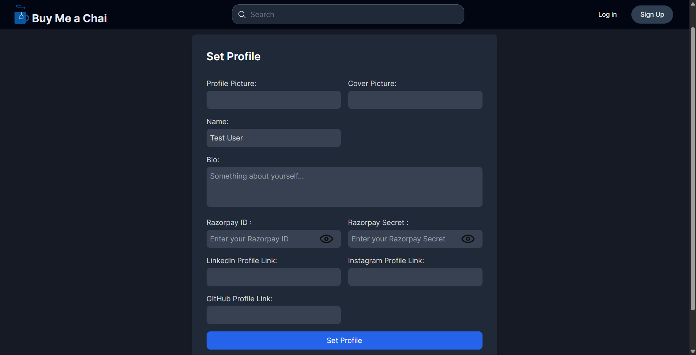
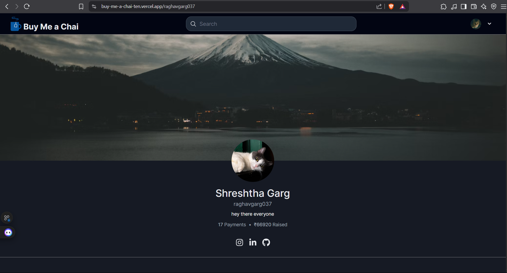
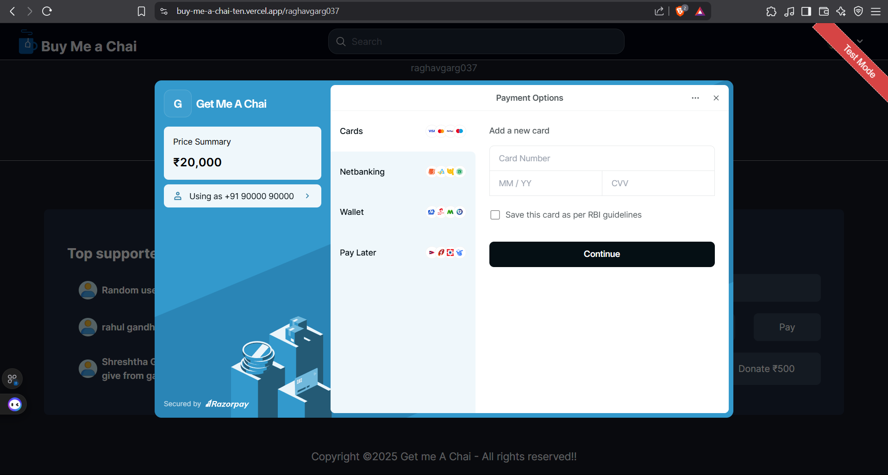
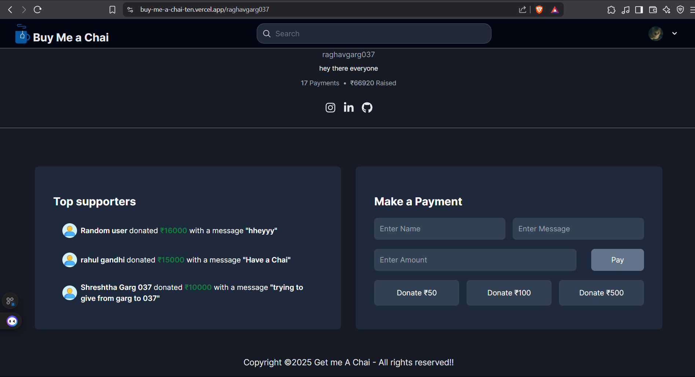
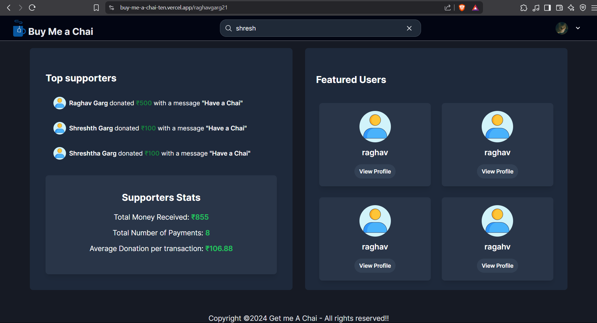
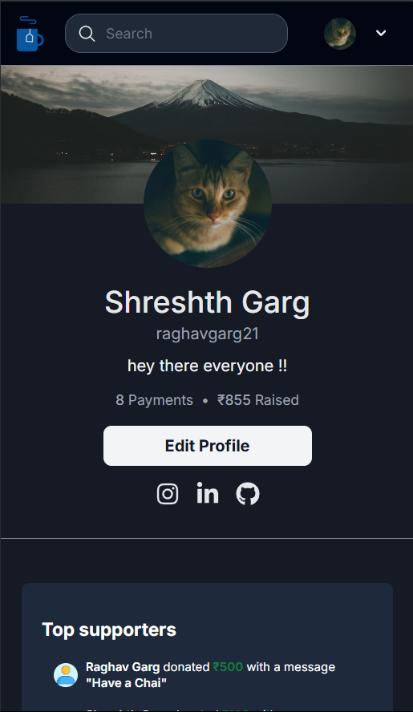
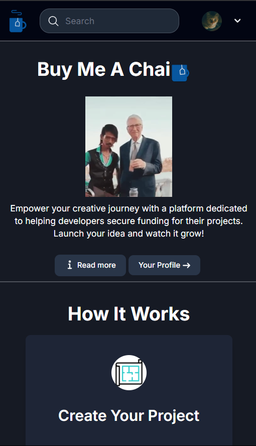
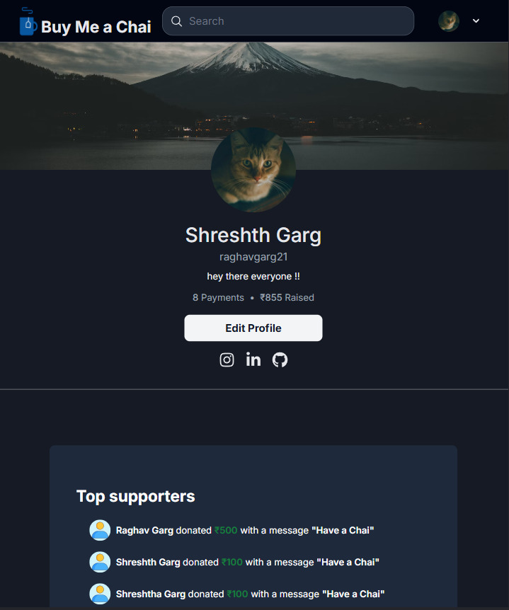

# ☕ Buy Me a Chai

**Buy Me a Chai** is a fun and friendly crowdfunding platform where creators and developers can receive support from fans—just like Patreon or Buy Me a Coffee. Think of it as a digital way to say *"Thanks for your work, here's a chai!"*

🔗 **Live Demo**: [https://buy-me-a-chai-ten.vercel.app/](https://buy-me-a-chai-ten.vercel.app/)

---

## 🚀 Overview

Buy Me a Chai is a full-stack MERN application powered by **Next.js 14 (App Router)** and **Razorpay**, enabling developers to create shareable profiles and receive payments in real-time.

Built using:

- **Frontend**: React, Next.js, Tailwind CSS
- **Backend**: Node.js, Express.js, MongoDB
- **Auth**: GitHub OAuth + Credentials (NextAuth)
- **Payments**: Razorpay
- **UI Tools**: React Toastify, bcryptjs, JWT

---

## ✨ Features

### 🏠 Homepage

#### 🌟 Public Homepage  

---

### 🔐 User Authentication

#### 🔑 Login Page  

#### 🆕 Signup Page  

---

### 👤 Profile Management

#### 👨‍💻 Set Up Your Profile  

#### 🧾 Public User Profile  

---

### 💸 Razorpay Integration

#### 💳 Payment Modal  

#### ✅ Payment Success  

#### 🧾 Make a Payment  

---

### 📊 Supporter Stats

#### 📈 Donations Overview for Creators  

---

### 📱 Fully Responsive Design

#### 📱 Responsive Preview

#### 📱 Responsive Preview

Experience seamless design across all devices.

- 📱 Mobile View  
  

    
    
  

- 💻 Tablet View  
  

---

## 💬 Made With Love

Made with ❤️ by [Shreshtha Garg](https://www.linkedin.com/in/shreshth-garg-3ba629208/)

---

## 📜 License

MIT License
